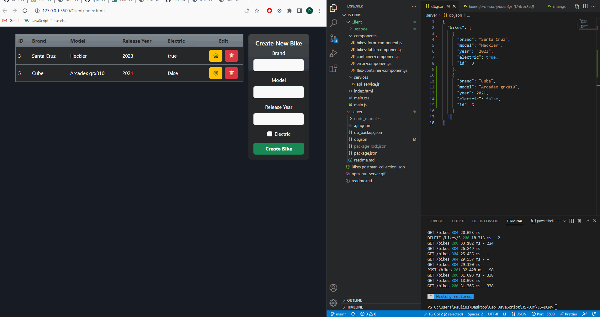

# __Fullstack CRUD application__

CRUD Application files are divided in two folders (__Server and client folders__). Server folder has it's own instructions in [__GitHub readme.md__](https://github.com/PaulKisonas/JS-DOM/blob/master/server/readme.md) file and [__direct readme.md__](client/readme.md) file.

## __Application example__

## __Requests examples__

Requests examples can be viewed using [__Postman__](https://www.postman.com/downloads/). Request examples are given in [__Postman File__](./Bikes.postman_collection.json), which can you import in program.

## __Code View__

You can view code in Visual studio instance using [__GitHub dev link__](https://github.dev/PaulKisonas/JS-DOM)