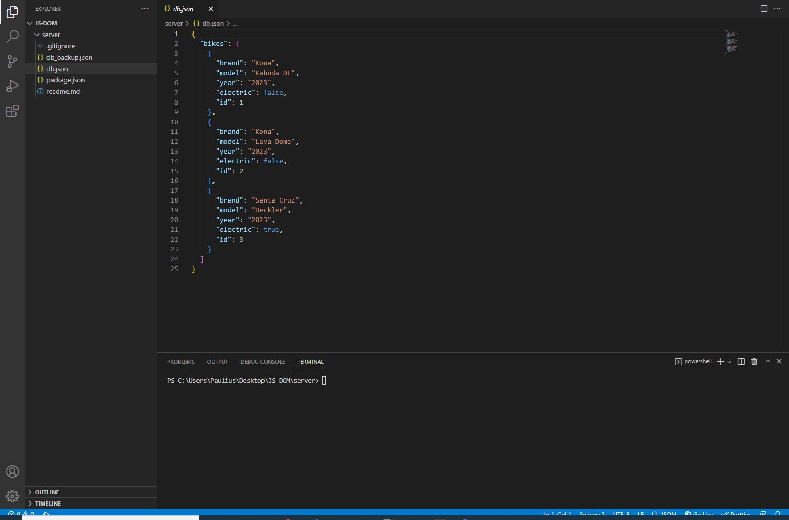

# __Fullstack CRUD application__

## _Required Programs_
  * Node v18.x.y or higher

## _Instalation_
Open console or terminal and run:
```
  npm install
```


## _Project launch_
Open console or terminal and run:
```
  npm run server
```
